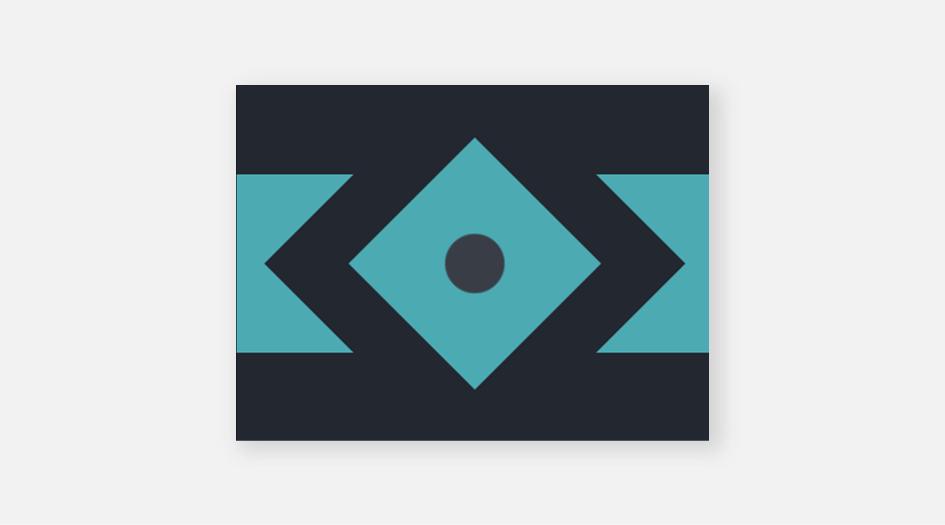

# #9 - Tesseract

## 💥 Challenge


## 🔎 Link
[Try it too and go to battle!](https://cssbattle.dev/play/9)

## 💡 Solution
```
<div class="rectangle">
  <div class="square">
    <div class="circle"><div>
  </div>
</div>
<style>
  body {
    margin: 0px;
    display: grid;
    place-content: center;
    background: #222730;
  }
  .rectangle {
    width: 400px;
    height: 150px;
    background: #4CAAB3;
    position: relative;
  }
  .square {
    width: 150px;
    height: 150px;
    position: absolute;
    transform: rotate(45deg);
    top: -50px;
    left: 75px;
    border: 50px solid #222730;
    background-color: #4CAAB3;
    -webkit-backface-visibility: hidden;
  }
  .circle {
    position: absolute;
    background: #393E46;
    width: 50px;
    height: 50px;
    top: 50px;
    left: 50px;
    border-radius: 50%;
  }
</style>
```
