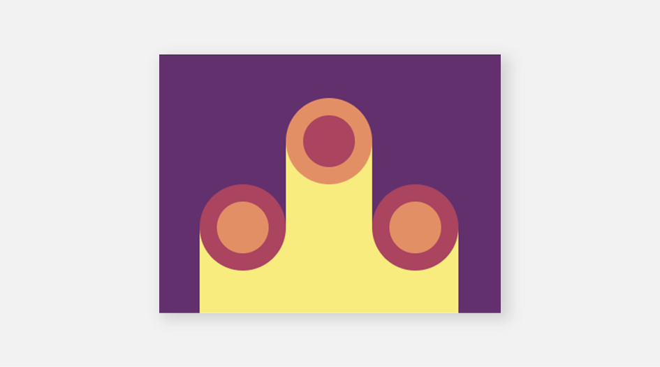

# #10 - Cloaked Spirits

## 💥 Challenge


## 🔎 Link
[Try it too and go to battle!](https://cssbattle.dev/play/10)

## 💡 Solution
```
<div class="smaller-rectangle"></div>
<div class="rectangle"></div>
<div class="smaller-rectangle"></div>
<style>
  body {
    margin: 0px;
    display: flex;
    justify-content: center;
    align-items: end;
    background: #62306D;
  }
  .rectangle {
    width: 100px;
    height: 200px;
    background: #F7EC7D;
    position: relative;
  }
  .rectangle::after {
    content:"";
    display: block;
    height: 60px;
    width: 60px;
    background: #AA445F;
    border: 20px solid #E38F66;
    border-radius: 50%;
    position: absolute;
    top: -50px;
  }
  .smaller-rectangle {
    width: 100px;
    height: 100px;
    background: #F7EC7D;
    position: relative;
  }
  .smaller-rectangle::after {
    content:"";
    display: block;
    height: 60px;
    width: 60px;
    background: #E38F66;
    border: 20px solid #AA445F;
    border-radius: 50%;
    position: absolute;
    top: -50px;
  }
</style>
```
