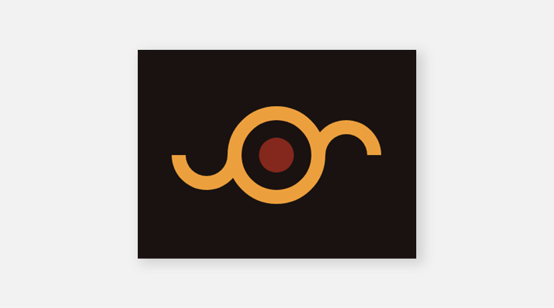

# #11 - Eye of Sauron

## 💥 Challenge


## 🔎 Link
[Try it too and go to battle!](https://cssbattle.dev/play/11)

## 💡 Solution
```
<div class="circle">
  <div class="half-circle"></div>
  <div class="half-circle"></div>
  <div class="smaller-circle"><div>
</div>
<style>
  body {
    margin: 0px;
    display: flex;
    place-content: center;
    align-items: center;
    background: #191210;
  }
  .circle {
    width: 100px;
    height: 100px;
    background: #191210;
    border: 20px solid #ECA03D;
    border-radius: 100px;
    position: relative;
  }
  .half-circle {
    width: 60px;
    height: 30px;
    background: #191210;
    border: 20px solid #ECA03D;
    border-radius: 0px 0px 50px 50px;
    border-top: 0;
    position: absolute;
  }
  .half-circle:nth-child(1) {
    left: -100px; 
    bottom: .4px;
  }
  .half-circle:nth-child(2) {
    right: -100px; 
    top: .4px;
    transform: rotate(180deg);
  }
  .smaller-circle {
    width: 50px;
    height: 50px;
    border-radius: 50px;
    background: #84271C;
    position: absolute;
    top: 25px;
    left: 25px;
  }
</style>
```
