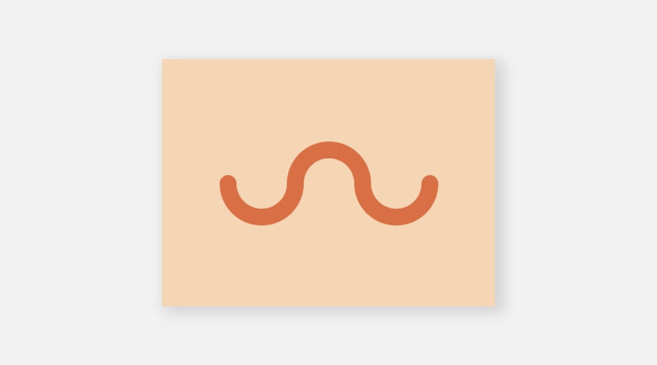

# #12 - Wiggly Moustache

## 💥 Challenge


## 🔎 Link
[Try it too and go to battle!](https://cssbattle.dev/play/12)

## 💡 Solution
```
<div class="retangle">
  <div class="half-circle"></div>
  <div class="half-circle"></div>
  <div class="half-circle"></div>
</div>

<style>
  body {
    margin: 0px;
    display: flex;
    place-content: center;
    align-items: center;
    background: #F5D6B4;
  }
  .retangle {
    background: #F5D6B4;
    display: flex;
    height: 100px;
    position: relative;
    align-items: flex-end;
  }
  .half-circle {
    width: 60px;
    height: 30px;
    background: #F5D6B4;
    border: 20px solid #D86F45;
    border-radius: 0px 0px 50px 50px;
    border-top: 0;
    position: relative;
    left: 20px;
  }
  .half-circle::after {
    content: "";
    display: block;
    width: 20px;
    height: 20px;
    border-radius: 20px;
    position: absolute;
    top: -10px;
    left: -20px;
    background: #D86F45;
    }
  .half-circle:nth-child(3)::after{
    left: initial;
    right: -20px;
  }
  .half-circle:nth-child(2){
    transform: rotate(180deg);
    align-self: flex-start;
    left: initial;
  }
  .half-circle:nth-child(3) {
    left: initial;
    right: 20px;
  }
</style>
```
